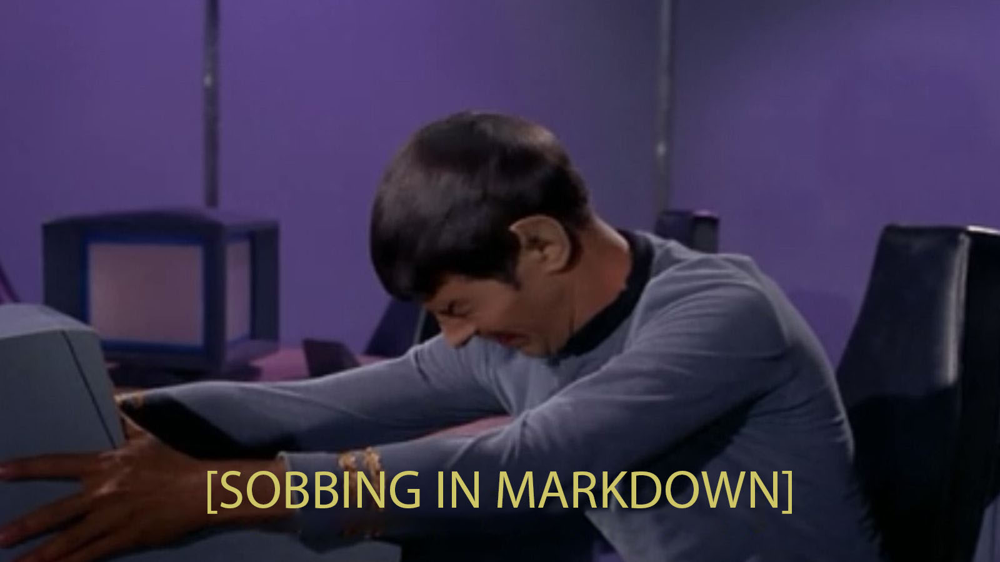

# Пример док-та
## Даниилов Фёдор Дерюгинович
## Дата: 10-09-2024
# Начало
Тут не важно какой текст главное, чтоб текст. Вот
А ещё нужно чтоб Марк-даун мог это всё грамотно понять и передать дальше
# Тэйбл

| Столбец Ван | Столбец Дам |
|-------------|-------------|
| Данные 1    | Свыше 2     |

# Имаге

# Table2

<table>
    <tr>
        <th>Заголовок 1</th>
        <th>Заголовок 2</th>
    </tr>
    <tr>
        <td>Ячейка 1.1</td>
        <td>Ячейка 2.1</td>
    </tr>
    <tr>
        <td>Ячейка 1.2</td>
        <td>Ячейка 2.2</td>
    </tr>
</table>

# Кончало
